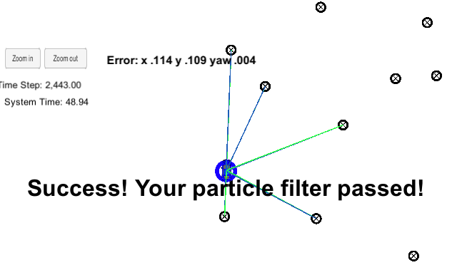

# Kidnapped vehicle


## Project Introduction
Your robot has been kidnapped and transported to a new location! Luckily it has a map of this location, a (noisy) GPS estimate of its initial location, and lots of (noisy) sensor and control data.

In this project I implemented a 2 dimensional particle filter in C++. The particle filter is given a map and some initial localization information (analogous to what a GPS would provide). At each time step my filter also gets observation and control data. 

## Running the Code
This project involves the Term 2 Simulator which can be downloaded [here](https://github.com/udacity/self-driving-car-sim/releases)

This repository includes two files that can be used to set up and intall uWebSocketIO for either Linux or Mac systems. For windows you can use either Docker, VMware, or even Windows 10 Bash on Ubuntu to install uWebSocketIO.

Once the install for uWebSocketIO is complete, the main program can be built and ran by doing the following from the project top directory.

1. mkdir build
2. cd build
3. cmake ..
4. make
5. ./particle_filter

Alternatively some scripts have been included to streamline this process, these can be leveraged by executing the following in the top directory of the project:

1. ./clean.sh
2. ./build.sh
3. ./run.sh

Tips for setting up your environment can be found [here](https://classroom.udacity.com/nanodegrees/nd013/parts/40f38239-66b6-46ec-ae68-03afd8a601c8/modules/0949fca6-b379-42af-a919-ee50aa304e6a/lessons/f758c44c-5e40-4e01-93b5-1a82aa4e044f/concepts/23d376c7-0195-4276-bdf0-e02f1f3c665d)

# Implementing the Particle Filter

These methods from the starter code were modified by me:

The method ```init``` (lines 22-49) populates the filter with 100 particle from normal distribution with mean given by GPS measurement and deviation given by sensor error from manufacturer.

The method ```prediction``` (lines 54-82) predicts the position of the particles from the last position to current timestep. The equations utilize bicycle model. Gaussian noise is added to simulate the stochastic nature of the motion.

The method ```dataAssociation``` was not used, I included the association of observations with landmarks directly in the method ```updateWeights```

The method ```updateWeights``` (lines 93-152) predicts observed measurement for each particle, compares it to actually observed measurements (transformed from vehicle into global frame of regerence) and updates the weight of that particle using multivariate Gaussians.

The method ```resample``` (lines 154-187) uses the resample wheel technique to select with repetition 100 new particles from the old 100 particles based on probabbilty given by their weight. 


# Conclusion

My particle filter successfully loclalizes the robot in about 49 seconds with x position error of 0.114 m, y error of 0.109 m and theta error of 0.004 rad. Thus meeting the project evaluation criteria.



For improving the filter I have following ideas:

1. During the resampling, I only eradicate the original particles from the initial sampling. I could either reduce the number of particles or add new unique particles with each resampling to improve accuracy. 
